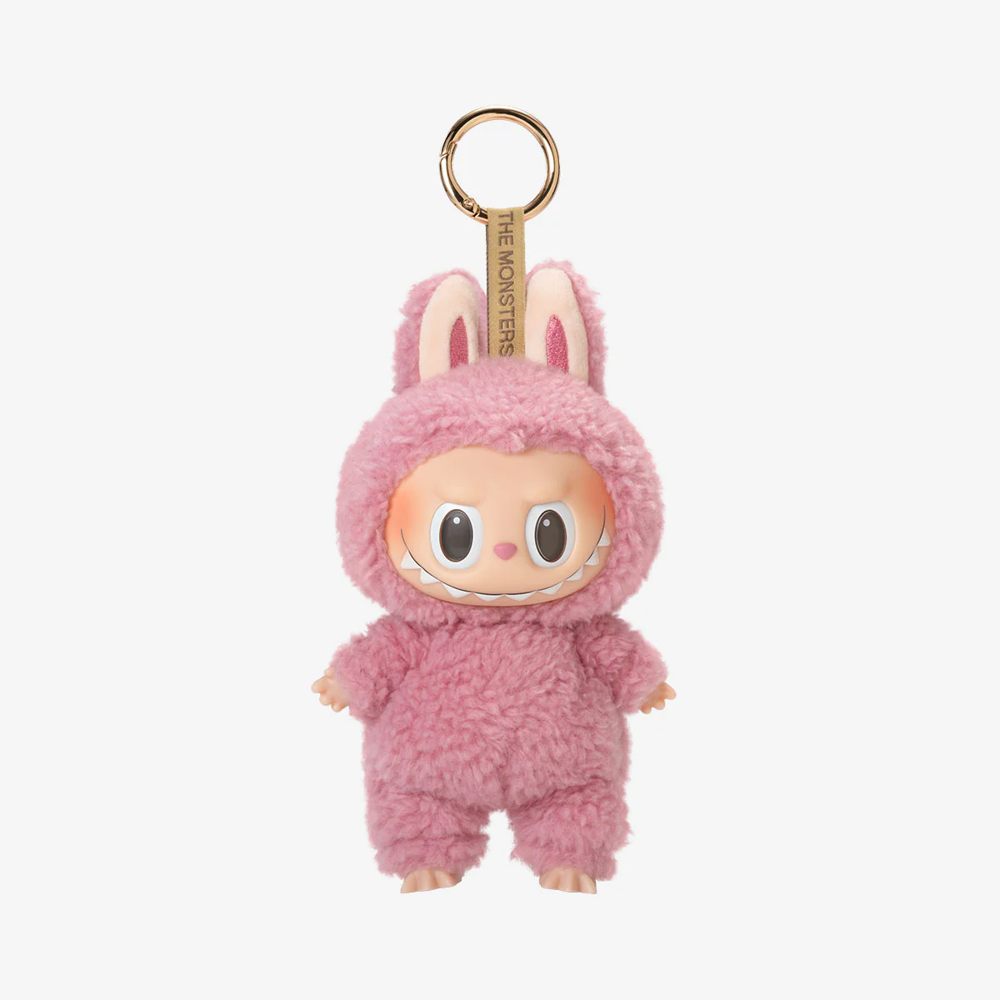
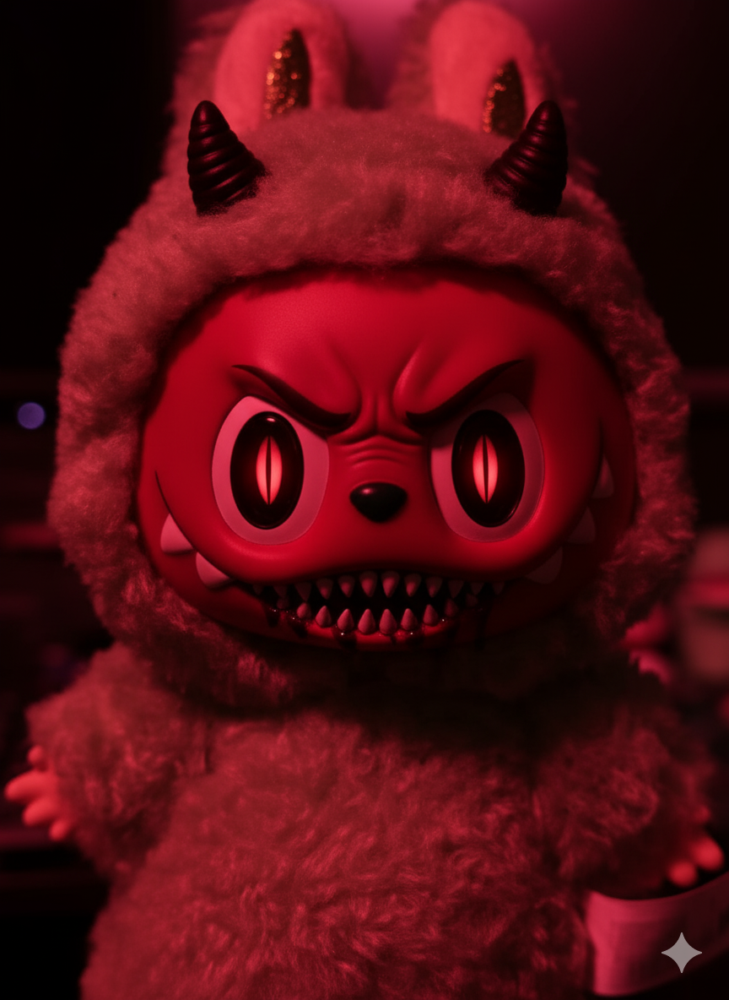
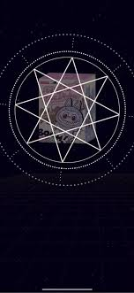
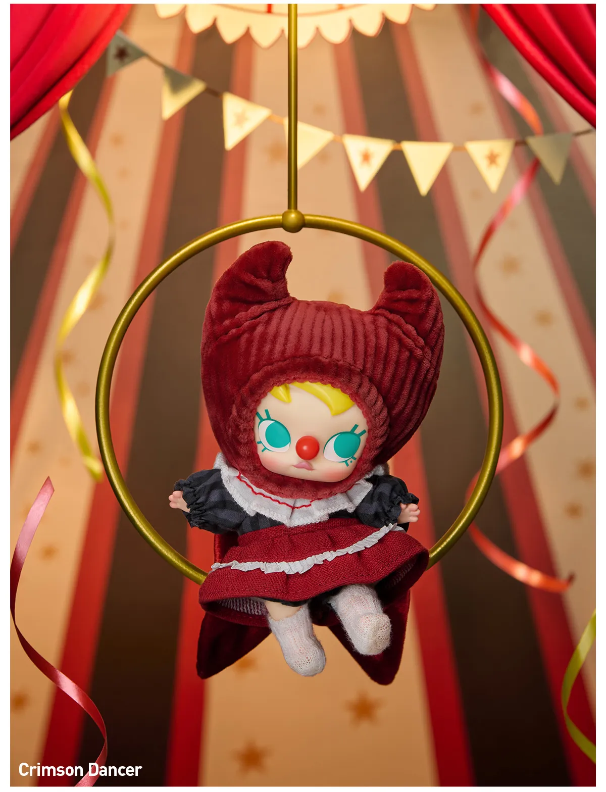

Reasons why I think labubus are demonic

 

---

1. the term "labubu" is possibly derived from the ancient demon named "Pazuzu"

2. The official POP Mart app has a pentagram in the labubu game

 

3. the [official site](popmart.com) sells/lists [pictures of the dolls in satanic/demonic outfits](https://www.popmart.com/us/products/3866/why-so-serious-series-vinyl-plush-pendant-blind-box?srsltid=AfmBOoojMj1pos-YhlbOnKEBcYZvOjWWL1jPRZTUjEZ1pzKqHdfL7n_z)
 

[Listing:](https://www.popmart.com/us/products/3866/why-so-serious-series-vinyl-plush-pendant-blind-box?srsltid=AfmBOoojMj1pos-YhlbOnKEBcYZvOjWWL1jPRZTUjEZ1pzKqHdfL7n_z)/)
